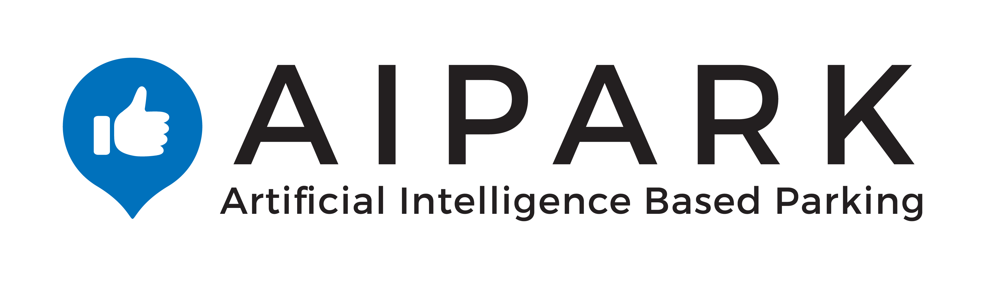

# AI Park

  

---------

Finding a parking spot is the last pain point in the entire driving experience and creates 30% of all city traffic. AIPARK tackles this problem by providing drivers with accurate availability information for parking spots using a cloud-based platform. The system uses crowdsensing with 6+ Mio. connected devices, low-cost IoT sensors and CCTV video analysis to supply parking predictions and real-time availability data to extend existing mobility services on all platforms: Connected Vehicles, Mobile Apps and Traffic Management. Today, AIPARK already has 1 Mio. monthly active end-users through integrations with its B2B customers Volkswagen, Audi, Deutsche Bahn and plenty more.

### Provided data

AIPARK provides you with access to their API for the duration of the Hackathon with the credentials below:

#### AIPARK API documentation: <https://developer.aipark.de/>

API-Key: `smart_country_hack`

#### AIPARK Webapp: <https://webapp.aipark.de>

User: `smart_country_hack`
PW: `aipark_demo`
